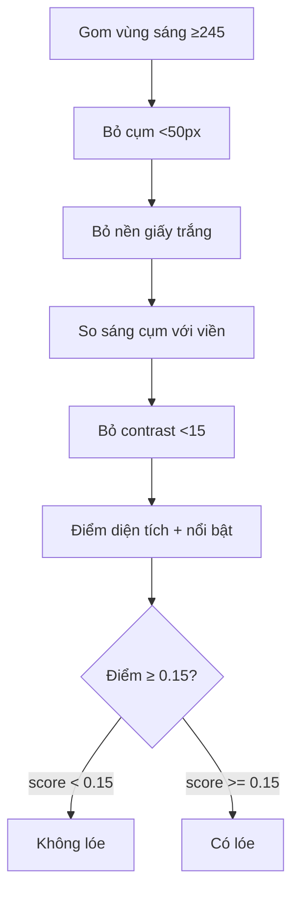

# Explain (gsuper)

**Not** implement. **Not** `gsuper-learn-pack` (ticket map + quiz). **Not** `gsuper-learn-material` (lesson + sample). **Not** `gsuper-write-spec-algorithm` (lock a recipe). **Not** brainstorm Teach (mermaid + I/O table before Grill).

Explain the target mechanism as a **chain of short steps**, not a prose paragraph and not a numbered list with headers. This is the format the user has confirmed reads fastest for them.

Default to **chat only**. Switch to the **file mode** (below) only when the user asks for a file/doc/note to keep or share — signs: "tạo md file", "lưu lại", "note ra file", "cho tôi 1 file", or they name a reader other than themselves.

## Format

- One step per line, each ending in `->` to chain into the next (last step has no `->`, ends with the conclusion/decision).
- Each step = **one action** in everyday words, optionally followed by a short parenthetical giving the *why* or the concrete number/threshold involved. Do not separate the "what" and the "why" into different lines.
- Plain language first: describe what actually happens physically/visually before naming the technical term. If a technical term or abbreviation is unavoidable, gloss it in ≤4 words the first time it appears, then use it freely after.
- No filler transitions ("Đầu tiên", "Sau đó", "Tiếp theo"), no restating what the arrow already implies.
- Keep it short — this is for a chat reply, not a document. Target 6-10 steps; if the real mechanism has more sub-steps, collapse the less important ones rather than listing everything.
- End with the actual decision rule (the threshold/comparison that produces the final answer), not a vague summary sentence.
- Match the user's language (Vietnamese in this workspace unless they ask otherwise).

## Worked example

Format sample (glare-detection scoring, `analyze_glare()` — not a file in this plugin):

```
Gom các vùng sáng có độ sáng cao nhất (≥245) thành từng cụm liền nhau (connected components) ->
Bỏ cụm quá nhỏ (<50px, coi là nhiễu) ->
Bỏ cụm chiếm gần hết cả ảnh (>75%) mà cả ảnh vốn đã sáng (avg >230) — nghi là nền giấy trắng, không phải lóe ->
Với cụm còn lại: so độ sáng cụm với viền ngay xung quanh nó (contrast = độ sáng cụm − độ sáng viền) ->
Bỏ cụm không nổi bật hơn viền được bao nhiêu (contrast <15) — coi như không phải điểm chói thật ->
Cụm còn sống: tính điểm theo diện tích cụm (so với cả ảnh) + mức nổi bật trung bình ->
Điểm vượt ngưỡng 0.15 -> kết luận ảnh có lóe.
```

Notice: no headers, no bullet symbols other than the arrow, every parenthetical is a real number or a real reason pulled from the code — never invented or rounded away.

## When asked to go deeper

If the user then asks "vì sao bước X lại vậy" or wants the exact formula for one step, drop back into normal prose/code-block explanation for just that step — don't rewrite the whole chain with extra detail unless asked.

## Source discipline

Every threshold, number, and reason in the chain must come from the actual code/config (read it, don't recall from memory if unsure) or from a real, cited measurement. If a number is uncertain, say so rather than smoothing it into the chain.

## Self-check before sending

Before sending (chat or file), reread the draft once as someone seeing this mechanism for the first time, then check:

- One read is enough to reach the decision — no step needs a second pass to parse.
- The plain-language "what happens" comes before the technical term in every step, not after.
- Every parenthetical is a real number/reason pulled from the code — not filler, not a restatement of what the arrow already says.
- The last step is the actual decision rule (the comparison/threshold), not a summary sentence.
- No step exists only to pad the count toward 6-10 — cutting it would lose part of the decision, not just words.

Any check fails -> revise once, silently. Don't show the failed draft and don't narrate the check ("để tôi rà lại...") — just send the fixed version. One revision pass is enough; don't loop.

## File mode: .md with chart + explanation

When the user wants a file, write a single Markdown file — not HTML, not a full report — with exactly two parts, in this order:

1. **A mermaid flowchart** built 1:1 from the arrow-chain: one node per step, in the same order, arrows in the same direction. Node labels are the short plain-language action from the chain (a few words, not the full sentence); put the threshold/number/reason from that step's parenthetical in a short label on the arrow or node instead of a separate paragraph — the diagram should be readable on its own without the text below it.
   - Use `flowchart TD` (top-down) for a linear pipeline. Use a decision-diamond node (`{...}`) for the final threshold check, with two labeled arrows out of it (e.g. `-->|"score < 0.15"| Pass`, `-->|"score >= 0.15"| Detected`) rather than folding the decision into a plain box.
   - Keep node text short (≤6-8 words) — long sentences in a node make the diagram unreadable. Move any longer reasoning to the explanation section below instead.
   - Every chart is a ` ```mermaid ` fence — never a bare `flowchart`.



2. **The explanation**, directly below the chart, as the same arrow-chain content from the "Format" section above, reformatted as a short bullet per step (drop the `->`, since the chart now carries the flow) — still plain language, still real numbers, still no filler transitions. This is the section a reader skims when the diagram alone isn't enough.

Nothing else — no title-table header block, no acceptance-criteria/out-of-scope sections, no background/context prose. If the user wants that framing too, that's a different, separate request (a full doc/report), not this skill.

Ask where to save the file only if the user didn't say (a path, or "cạnh file X"); otherwise write it there directly. Keep the filename descriptive of the mechanism, not generic (`glare-v3-mechanism.md`, not `explanation.md`).
