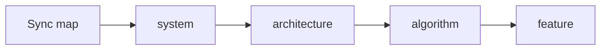

# Write spec (gsuper) — router

**Not** ticket AC. Ticket = **gsuper-write-plan**.

Run **only when the user asks**. Fuzzy “build X” → **gsuper-brainstorm**.

**One pass = one kind.** **Plain language.**

## Sibling kinds — suggest, never auto

Writing or updating **feature** (or any one kind) does **not** auto-update the others. After the file of this pass:

1. List siblings that **changed because of this increment** (one line each: kind + why). Skip if no drift (`captions` stays if How unchanged).
2. Ask: update which row, or none.
3. **Wait.** Next pass = that kind only.

Do **not** patch system / architecture / algorithm in the same turn as a feature. Do **not** sync specs after implement unless the user asks. Ship path stays plan → implement.

## Sync first (large repo already there)

User says sync / phân tích / project có sẵn (có hoặc **không** có `specs/`) → **gsuper-write-spec-sync** ([references/sync.md](references/sync.md)). Inventory → map → **wait** → one kind.

Empty kind folders → write **system** only, stop.

## New increment (docs chain)

[references/spec-flow.md](references/spec-flow.md). Mermaid fence in **chat** and files.

```text
intent → system → architecture (core) → algorithm → feature → plan
```

## Route

| User / gap | Skill | Shape |
|------------|--------|--------|
| Sync repo lớn | **gsuper-write-spec-sync** | sync.md |
| Hệ, actors, context | **gsuper-write-spec-system** | system-shape.md |
| Lớp, core, store | **gsuper-write-spec-architecture** | architecture-shape.md |
| Recipe / How | **gsuper-write-spec-algorithm** | algorithm-shape.md |
| Shall / parent-child / Problem | **gsuper-write-spec-feature** | feature-shape.md |

Index: [references/spec-template.md](references/spec-template.md).

**Fail:** system file with feature shall table; algorithm file with only import law.

Unknown folder → **ask**. No `specs/core/`.

## Shared

- One concept → one file. Do not write the same must/must-not into conventions.md — matching spec-doc. `conventions.md` is **not project law**.
- live = SDD-lite vs **đích** = SRS-lite. Feature **shall** + Verify. ## Technique when that shape asks (chọn / không dùng / vì sao / live|đích|**suy ra**).
- Flow: ` ```mermaid ` in chat + file + **what + why**.
- LLM ingest: SQL / FTS / vector — not implied vector. OWASP, guardrail, tracing, NFR concurrent when that kind owns them.
- Mode A = sync. Mode B = 2–3 options if Technique open; **wait**.
- **rewrite Design** if overclaim. Happy path vs fallback on **algorithm**.
- Apply check = the **sub-skill**. Names, Boundaries, Views, Standards, NFR, Contract, SRS-lite / SDD-lite, parent — only if that shape has them.
- Approve → `memory.py lock --kind spec --id <id>`.



```text
.agent-workflow/specs/<kind>/<feature>/<id>.md
.agent-workflow/plans/<feature>/YYYY-MM-DD-<ticket>.md
.agent-workflow/learn/<feature>/gsuper-pack-….md
```

Missing dirs → **gsuper-init-project**.

## Reflection

Shapes differ on purpose. Sync is a first-class pass for existing products. Sync = rewrite into the **kind** shape, not a verbatim copy of README.

Optional **gsuper-learn-pack**. No write-plan unless a ticket starts.
