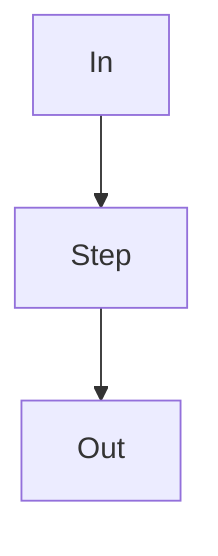

# Algorithm shape (only `specs/algorithm/`)

Not HTTP. Not “we use LangGraph”. Reader sees **input → steps → output**.

```markdown
# <Name> — Algorithm

**Kind:** algorithm
**Id:** …

## Transforms
One sentence: X in, Y out. Why a recipe (easy to get wrong).

## I/O
| | Shape |
|--|--------|
| In | … |
| Out | … |

## Happy
Numbered steps. What + why each.

## Fallback
When happy cannot run. Different steps (example: json3 vs VTT).

## Keep / drop
What is discarded and why.

## Limits
Numbers or TBD (gap ms, chunk chars, retries).

## Runtime
Mermaid of the recipe only (not the whole app).



## Reflection
```

**Fail if:** same as feature (CC-01 shalls) or architecture (import table only).
