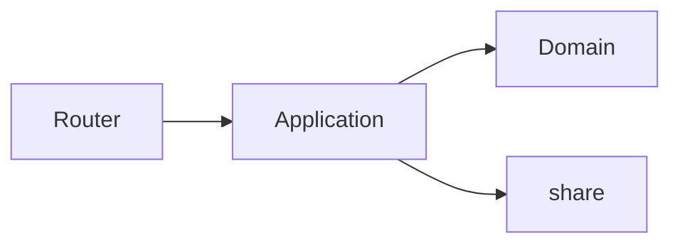

# Architecture shape (only `specs/architecture/`) — core

Not user shalls. Not recipe steps. Reader sees **how the machine is wired**.

```markdown
# <Name> — Architecture

**Kind:** architecture
**Id:** …

## Enables
Which product job this wiring serves (one paragraph).

## Layers
Import law. Who may call whom.

## Composition
Where the app is constructed (root). Routers do not own IO.

## Stores
| Store | Engine | Holds | Not |
|-------|--------|-------|-----|
| … | SQLite / … | … | vector unless chosen |

## AI and IO
Where SDK / subprocess live. Ports vs adapters.

## Runtime
Mermaid: request → façade → port → adapter.



## Seams
Names only. Technique table lives on **feature** if needed — not copied here.

## Constraints
must / must-not + file when live.

## Reflection
```

**Fail if:** copy-paste feature Requirements; or skip Stores when text+LLM exists.
