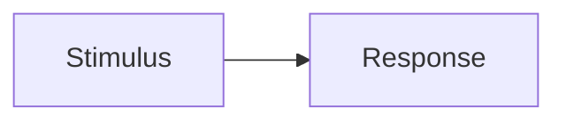

# Feature shape (`specs/feature/`)

Theo **tính năng** (cùng slug ở algorithm / plans / learn):

```text
feature/<feature>/index.md
feature/<feature>/<child>.md
algorithm/<feature>/<id>.md
plans/<feature>/YYYY-MM-DD-<ticket>.md
learn/<feature>/gsuper-pack-….md
```

**Fail if:** nhiều feature `.md` cùng cấp `feature/`, hoặc plan/pack phẳng ở root kind. `srs/` không thay index.

Not system context. Not import law. Reader sees **the job and shalls**.

```markdown
# <Name> — Feature

**Kind:** feature
**Id:** …
**Parent:** … (if child)

## Problem
Who / job / weakness today / strength of this approach.

## Scope and deferred

## Children
If parent: table only. Shalls on children.

## Model
Entities, identity, invariants.

## Flow
What + why + stimulus + response.



| Step | What | Why | Stimulus | Response |
|------|------|-----|----------|----------|
| … | … | … | … | … |

## Requirements
| Id | shall | Verify |
|----|-------|--------|
| XX-01 | … | … |

User + BE/AI/data. Not user-only.

## Contract
HTTP/fields/errors.

## Views
User / BE / AI / DB — jobs, not layer import.

## Standards
Named (29148, OWASP LLM, …) apply or defer.

## Load and safety
Numbers or TBD (or point at system).

## Technique
Constraints only (chọn / không dùng / vì sao / live|đích|suy ra). Not the How recipe.

## Reflection
```

**Fail if:** only structure; Flow without why; NFR with no numbers/TBD.
