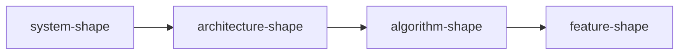

# Spec shapes (by kind)

Not a ticket. Ticket AC is the **plan**.

**Do not** use one outline for every file. Each kind has its own shape:

| Kind | Shape | Skill |
|------|--------|--------|
| system | [system-shape.md](system-shape.md) | gsuper-write-spec-system |
| architecture | [architecture-shape.md](architecture-shape.md) | gsuper-write-spec-architecture |
| algorithm | [algorithm-shape.md](algorithm-shape.md) | gsuper-write-spec-algorithm |
| feature / srs | [feature-shape.md](feature-shape.md) | gsuper-write-spec-feature |

Parent + children: `feature/<feature>/index.md`. Cùng slug: `algorithm|architecture|plans|learn /<feature>/`. `srs/` optional.

Large existing repo (specs missing or stale): [sync.md](sync.md) → **gsuper-write-spec-sync**.

After one kind: **suggest** sibling drift, never auto-update the others. See [spec-flow.md](spec-flow.md).

Shared only: **plain language**, Problem/Job first, mermaid in a ` ```mermaid ` fence in **chat** and files, ## Technique when the kind needs chọn/không dùng/vì sao (**đích** / live / suy ra). Sync = rewrite into the **kind** shape, not a verbatim copy.



Feature-shape still has ## Flow, ## Names, ## Boundaries, ## Requirements, ## Views, ## Standards, ## NFR, ## Problem, shall, SRS-lite, input / uses / output — do not copy those into system.
