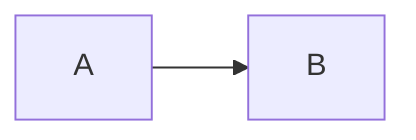

# Spec template (project document)

Not a ticket. Not implement AC. Ticket AC is the **plan**.

**Kind** must match the folder: `algorithm` | `srs` | `feature` | `architecture` | `system`.

Write so a human can read it without the repo. Write or update only when the user asks. Sync = rewrite into this shape, not a verbatim copy.

```markdown
# <Title> — Spec

**Kind:** architecture
**Date:** …
**Status:** Draft for review | Approved
**Id:** captions

## Purpose
What this document is (feature / algorithm / SRS / system design) — **plain language**.

## Sources
- `path` — what we took from it (one line)

## Flow

User-visible steps when this area runs. Mermaid **and** I/O table when there is a flow. One-page algorithm: table only is OK.



| Step | Input | Uses | Output |
|------|--------|------|--------|
| A | … | … | … |

## Design
The architecture, algorithm, or SRS body. Short sections. Real names. No ticket Do/Done when.

## Constraints
- must / must-not for this area (product rules, not this sprint)

## Reflection
Leftover risk after Apply (conventions stale, open product questions). **Do not** leave a Design sentence that contradicts live code.

## Open questions
1. …
```
