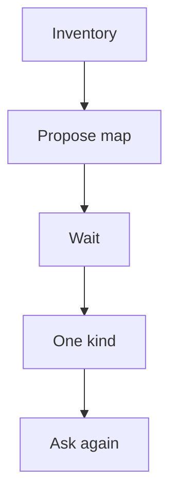

# Sync — large repo already exists

Use when the user says **sync / phân tích docs / project có sẵn** — whether `specs/<kind>/` is empty or stale.

**Not** the ship path. **Not** “write all kinds now”.

1. **Inventory** (do not dump bodies):
   - Code: apps/, packages/, compose
   - Docs: `SRS/`, `docs/`, README
   - Specs: `specs/<kind>/*.md`, dated `specs/YYYY-MM-DD-*`
   - Leftover `conventions.md` (fold then stop treating as law)
2. **Map** (table, then **stop**):

   | Source | Kind | Id | keep / rewrite / create / skip |
   |--------|------|-----|-------------------------------|
   | … | system | … | … |

   Empty `specs/<kind>/` + large code → **create** `system` first, then wait.
   Has specs but drift vs code → **rewrite** the kind that lies; mark suy ra.
3. **Wait** until the user picks a row.
4. **One kind** → matching sub-skill + **that kind’s shape** (not feature-shape for system).
5. Ask: next row or stop.

No verbatim copy of README into `specs/`. Skip ticket plans unless named.
